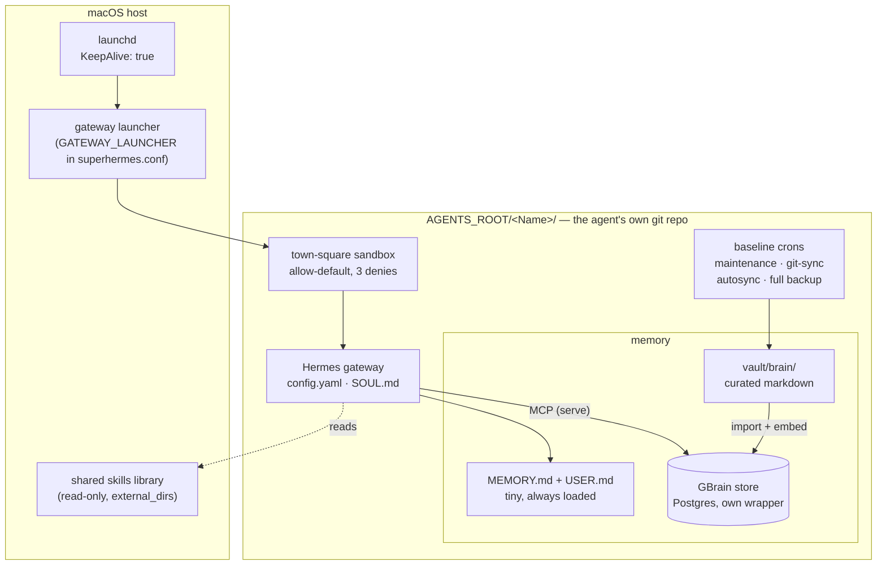
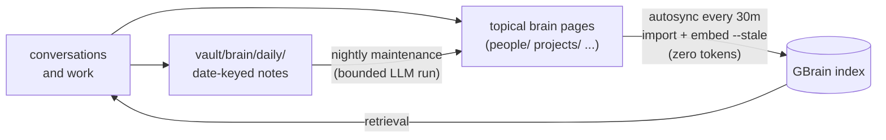
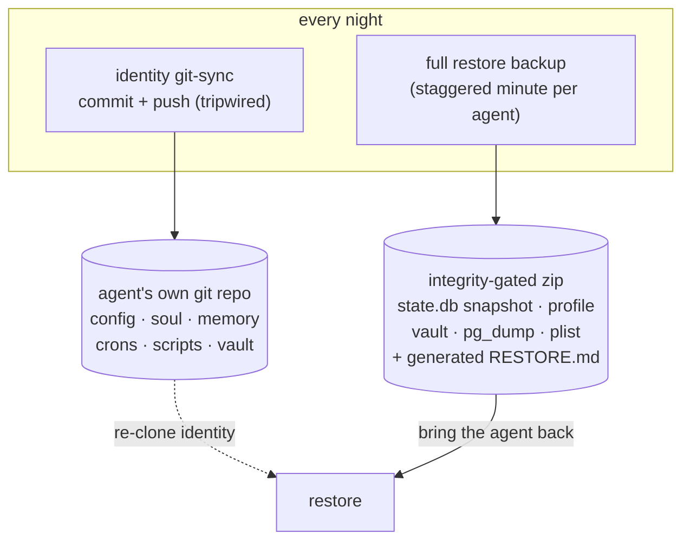

# Architecture Decisions

The durable decisions behind SuperHermes — the *why*, not the *what*. The README
and the guides in [docs/](docs/) describe how an agent is built today; this file
records the reasoning that shouldn't change as the implementation evolves. Each
entry is a decision plus the failure it prevents.

## The shape of one agent

Everything below serves this picture: one self-contained agent, every arrow
inside its own home.

The boundary rule: the **template** defines everything inside the agent box;
the gitignored `superhermes.conf` names everything outside it (launcher, backup
destination, secrets tenant, skills path). Nothing inside the box may point at
a specific machine or platform.

## How memory stays alive

Two backups cover two different losses:

---

### 1. Every agent stands alone
**Decision.** No agent's runtime, memory, or tooling may depend on another agent's
files. Shared things live in one shared place; private things live in the agent's
own home. Nothing in between.

**Why.** A "shared" GBrain wrapper that exec'd into one agent's private Bun cache
made every agent depend on that one agent — wipe its cache and others broke.
Independence means a failure in one agent can't cascade.

### 2. The sandbox is the sole write boundary — "town-square," allow-all-then-deny
**Decision.** The OS sandbox (`sandbox-exec`) grants free reign over normal
macOS, browser, GPU, app, temp, and runtime paths. It denies only file boundaries:
no writes to another agent root, no access to another macOS user home, and no
access to `/Users/Shared`. It is not an allowlist and does not confine agents to
their own root.

**Why.** Allowlist sandboxes drift and break ordinary tooling (PTYs, temp dirs,
Docker, GUI browsers) — every new tool needs a new rule. The real filesystem
boundary is narrow and stable: do not write in another agent root, do not cross
into another macOS user, and do not use `/Users/Shared`. Email and destructive
GitHub approvals are enforced at the tool/workflow layer, not by file paths.
QuickLook and Brave get explicit `process-exec` no-sandbox exceptions because
they create their own native macOS sandboxes; forcing them to inherit the Hermes
profile breaks screenshots and browser/GPU flows.

### 3. No application-level write gate (`HERMES_WRITE_SAFE_ROOT`)
**Decision.** Do not set the Hermes write-approval gate.

**Why.** It would prompt for approval on every write outside the agent's own home —
including legitimate work like maintaining a shared skills library or building
apps — while adding no protection the OS sandbox doesn't already enforce. Friction
with no upside.

### 4. GBrain: one Postgres store per agent, profile-isolated, own wrapper
**Decision.** Each agent installs its own GBrain runtime into its profile-home,
keeps one Postgres store, and points its `config.json`, MCP command, and CLI wrapper
at that one store. The MCP server block pins `HOME` and `HERMES_HOME` to the
profile, exactly as the wrapper does.

**Why.** The SQLite + shared-wrapper era produced two failures at once: a
**split-brain** (CLI and MCP writing to different stores, so memory silently
diverged) and a **cross-agent dependency** (the shared wrapper). Convergence on one
store kills the split-brain; profile isolation kills the dependency. Pinning the
env in *both* the wrapper and the MCP block means there is no code path left that
can resolve to a different store.

### 5. The middle memory layer was removed
**Decision.** The passive peer-learning layer (Honcho) was removed —
decommissioned in the reference deployment on 2026-07-15. Two layers remain:
session/state and the GBrain semantic store.

**Why.** A per-agent Dockerized stack that the agent never successfully read
from was pure operational weight — containers, ports, backups, and tier
matrices to keep healthy for no recall benefit. Fewer layers, each verified,
beats more layers half-alive.

### 6. Two memory layers, each with one job
**Decision.** Bootstrap (`MEMORY.md`/`USER.md`, tiny, always-loaded) · GBrain
(curated knowledge). Don't duplicate across them.

**Why.** Conflating them bloats always-loaded context and double-stores facts.
GBrain is what the agent *curates*; bootstrap is the handful of facts needed
every turn. Distinct jobs, distinct stores.

### 7. Config is generated/synced from one source — never hand-edited per agent
**Decision.** Per-agent config derives from templates and matrices, not manual edits.

**Why.** Hand-edited agents drift apart. A single audit found three different config
schema versions, split GBrain stores, and a missing memory-wiring file — all
silent. One source + a render/sync step makes drift structurally hard.

Profiles carry a `_config_version` (the reference deployment is currently 33)
migrated by Hermes's own migrate_config — never hand-edited.

### 8. A new agent is born inspired *and* safe
**Decision.** `SOUL.md` starts as a seed ("a new soul with unlimited potential…
craft your soul to partner with your human") paired with one iron law: no
real-world action without the human's approval. *Earn trust, then earn latitude.*

**Why.** Identity is the one file an agent should self-author, so seed a tone, not a
spec. But a day-one agent can send email and post to the world — so the iron law is
non-negotiable. Framing the boundary as a runway ("earn latitude") makes freedom
and safety point the same way.

### 9. No secrets in the repo
**Decision.** Credentials, tokens, and machine-specific paths live only in the
gitignored local config or the agent's own profile (`.env`) — never in a committed
file. *Where* those values come from is **pluggable**: paste into `.env`, or source
them from a secrets manager via Hermes's `secrets:` config (BitWarden Secrets
Manager is supported natively; the block renders enabled only when the operator's
conf provides a project id). The template declares the secret **keys** an agent
needs (`TELEGRAM_BOT_TOKEN`, etc.); the backend is the operator's choice and never
hardcoded. Inline tokens in tracked config are banned outright — the identity repo
tracks `config.yaml`, so an inlined token is a committed token.

**Why.** The template is open source — so it can't assume any one secrets backend
or carry any one tenant's ids. Declaring the keys and leaving the source pluggable
keeps it usable by a solo operator with a plain `.env` *and* by a deployment
centralising on BitWarden, with no fork. Secrets are recoverable; a leaked secret
in public git history is not.

### 10. Verify every layer independently — "looks set up" ≠ "works"
**Decision.** Never report a layer healthy without its own evidence: GBrain
store reachability, `gbrain stats`/`health` (embed coverage), sandbox compiles,
plist lints, config parses.

**Why.** A `vault/brain/` folder proves markdown exists, not that GBrain indexes it.
A running container isn't a healthy API. A present config file isn't a *loaded* one
(it can silently fall back to defaults). Each layer fails in its own way, so each is
verified in its own way.

### 11. Each agent is its own git repo at its root; `.gitignore` normalised, not centralised
**Decision.** Every agent is a standalone git repo rooted at `AGENTS_ROOT/<Name>/`.
Each carries its **own** copy of a **default-deny** `.gitignore` that follows one
shared standard — normalised (same rules everywhere) but not centralised (no shared
or symlinked file). The ignore allow-lists the durable identity and the open vault;
everything else is denied by default.

**Why.** *Per-agent repo* keeps the independence principle (decision 1) true at the
version-control layer — each agent's history is its own, pushable on its own, with
no monorepo coupling. *Default-deny* is the only model that's safe by
construction: an allow-list-on-top-of-deny can't leak a brand-new kind of secret,
whereas a deny-list silently tracks anything you forgot to exclude. An early audit
found one agent tracking 760+ files (including a retired memory plugin) next to
another tracking 28 — the same drift decision 7 fights, now fixed with one rendered
standard. *Normalised, not centralised* means a solo operator cloning one agent
gets a correct ignore with no dependency on a shared file.

### 12. A template, not a platform — machine truth lives in one gitignored file
**Decision.** The template knows nothing about any orchestration platform,
dashboard, or company. Everything machine- or operator-specific — gateway
launcher, backup destination, secrets tenant, skills library path, Postgres
admin role — lives in `superhermes.conf`, which is gitignored. The litmus test
for what belongs in the template: *would a lone agent on a fresh Mac need it?*

**Why.** Platform references rot the template in both directions: the platform
can't evolve without touching the template, and the template can't be published
or reused without dragging the platform along. One config file as the only
overlay point means a platform "adopts" the template by writing one file — and
the template's tests can enforce the boundary (rendered scripts are asserted
free of machine-specific home paths).

### 13. Four baseline crons, not two — and backups are staggered
**Decision.** Every agent is born with four scheduled jobs: nightly **memory
maintenance** (bounded LLM run), nightly **identity git-sync** (deterministic,
tripwired, pushes by default when a token exists), **GBrain autosync** every 30
minutes (zero tokens), and a daily **full restore backup** whose minute is
derived from the agent's slug so no two agents on one host dump at once.

**Why.** Each job covers a loss the others can't. Maintenance curates; without
autosync, a fact written in the morning isn't retrievable until midnight.
git-sync preserves identity *text*; only the full backup preserves `state.db`,
the vector store, and credentials — the difference between re-cloning a
personality and actually bringing an agent back. Push-on-by-default came from
running the withhold-by-default version in production: it produced agents that
committed forever, pushed never, and mentioned it only in cron output nobody
reads. And the stagger exists because seven agents proved that "daily at 03:00"
on one host means seven simultaneous `pg_dump`s into one disk.

### 14. Ship the config that survived de-fatting, not the stock defaults
**Decision.** The template's `config.yaml` carries every key that survived
deliberate *de-fatting* on long-running production agents — configs trimmed to
only the values that differ from Hermes defaults on purpose. Highlights:
`max_turns: 200`, auxiliary sub-agent routing with bounded delegation
(`subagent_auto_approve: false`), early+hard context compression, tool-search
with a pinned keep-core, curator GC, background-only computer use, a hardline
`approvals.deny` floor, and reversible session auto-archive. Model IDs are
never baked in.

**Why.** Stock defaults are tuned for an interactive assistant, not an
autonomous agent that runs for months: 24 max turns strands real work mid-task,
un-routed auxiliary roles burn primary-model quota on thumbnail work, and
unbounded delegation is a fork bomb with a model attached. A key that survived
an operator deliberately deleting everything non-essential is the strongest
evidence available that it's load-bearing. The deny floor exists because
"the model will be sensible" is not a safety property.

### 15. The chat experience: stream the answer, hide the machinery
**Decision.** In chat channels the agent streams its real answer and shows
long-running progress notifications — but tool chatter is off, progress bubbles
are cleaned up after the turn, and busy-acks stay terse
(`display.platforms.telegram` in the template). The SOUL seed pairs this with
an operating style: be proactive, take the task as far as possible before
coming back, and come back with solutions — context, work done, and a
recommendation ready for a yes — not problems.

**Why.** Modeled on the best-liked agent in the reference deployment. A chat
thread full of tool spam reads like a terminal; a silent agent reads like a
dead one. The combination that feels like a capable colleague is: visible
progress on long work, a clean thread afterwards, and messages that arrive
already carrying their answer. The experience is half config and half soul —
shipping only the config half produces an agent that streams beautifully and
still brings you problems.
